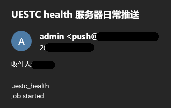

# UESTC Reportor

## 免责说明

注意！！！！！仅做学习使用，禁止用来瞒报打卡，违者后果自负
Forked from https://github.com/onion-rain/uestc_health_report

## 功能

* 每日平安打卡  
* 每日体温上报【已停用】  
* 宿舍有线网自动连接  
* 校园无线网自动连接  
* 阿里云邮件推送配置  

## 特色

* 统一身份认证滑块验证码的破解  
* 打卡自动化  
* 宿舍有线网、校园无线网守护  


---

# 配置

## geckodriver

* 需要下载firefox浏览器的[geckodriver](https://github.com/mozilla/geckodriver/releases)  
* 根据自己的操作系统，下载对应的.gz或.zip文件，解压后放进项目文件夹
* 经测试，在windows、linux（包括命令行，即浏览器无窗口模式）下使用firefox都没有问题
* 经测试无法使用chromedriver进行代替，猜测是拦截了chromium webdriver的某些关键字

## 环境

* 使用conda配置环境：
``` shell
conda env create -f environment.yml  
```
* 根据 personal_info_demo.py 的注释添加自己的信息，选择合适的首选项，并根据首选项选填额外个人信息
* 将 personal_info_demo.py 更名为 personal_info.py   

## 运行主程序

windows下
``` shell
activate slider
python main.py
```
linux下
``` bash
source /home/***/anaconda3/bin/activate slider
nohup python -u main.py > uestc_reportor.log 2>&1 &
```

## 单独运行模块

* 将需要运行的模块最后一段注释掉即可  
* 等同于在首选项里只勾选单独的模块，所以不推荐单独运行模块

---

# 实现思路

## 每日平安打卡、每日体温填报

* 通过chrome的develop tools的network, 在每日打卡填报时候进行抓包，找到进行每日报平安以及体温上报的api。
* 首先在postman中测试直接请求api是否可行，发现只需要带个人cookie以及报平安以及体温的参数即可。
* 其次还偶然发现并不需要与个人cookie进行绑定才能进行打卡的漏洞。换言之，登录账号与填报的信息不需要是同一个人。【漏洞已被修复】
* 对于体温上报的api，每日可以多次体温上报，并不只早中晚各一次，而是无限次，只是在前端做了限制。【体温填报已停用】
    > * 前端的逻辑是当点击了体温上报按钮后先调用查询体温上报的api，看当前时段是否打卡过，如果打过则弹窗已经打过结束；
    > * 如果没打过，则调用体温打卡的api，打卡当前次，之后再调用一次查询全部体温打卡记录的api刷新整个页面。
* 对于每日报平安的api，也是可以多次报平安，但页面上只显示最近的一次。故猜测后端有两种可能的实现方式，一是当天重复打卡的会覆盖掉上一次的，二是也是打卡无限次，但前端做了处理，只显示当天最近的一次打卡。【慎用】  
  


## 统一身份认证滑块验证码

* 登录提交的表单包含用户名、密码和滑块验证结果
* 分析网页资源，发现滑块验证码模块有两张图片，分别是带缺口的背景图和缺块图
* 提取缺口灰度图，进行边缘检测，从上之下扫描横线
  
  
  

* 提取背景灰度图，进行边缘检测，从左至右扫描直线，
  
  
  

* 定位缺口左上角顶点位置，再计算滑块需要滑动的距离
  
  

* 调用验证接口后，将验证结果加入登录表单中
* 不太完美，平均需要尝试两次

## 网络守护

* 每5分钟连一次百度，连不上意味着校园网账户下线了
* 校园无线网登录地址为10.253.0.213，宿舍有线网登录地址为10.253.0.235
* 由于网络登录无需验证，直接提交表单即可
* 再次打卡登录页面，查看是否存在“注销”按钮，存在即登录成功

## 邮件推送

* 使用了阿里云推送邮件服务
  
  
  
  

---

# 版本说明

* （fork前）2021.01 绕过验证码自动登录，定时打卡、填报体温  
* （fork前）2021.01 多人打卡  
* 2021.01 宿舍断网重连  
* 2021.01 邮件推送  
* 2021.01 【弃用】宿舍断网重连  
* 2021.09 优化邮件推送  
* 2021.09 【弃用】填报体温  
* 2021.09 一人登陆多人打卡bug已修复，改为登陆一人打卡一次  
* 2021.12 绕过滑块验证码的漏洞已修复，现加入边缘检测破解算法  
* 2022.01 宿舍有线网、校园无线网网络守护  
